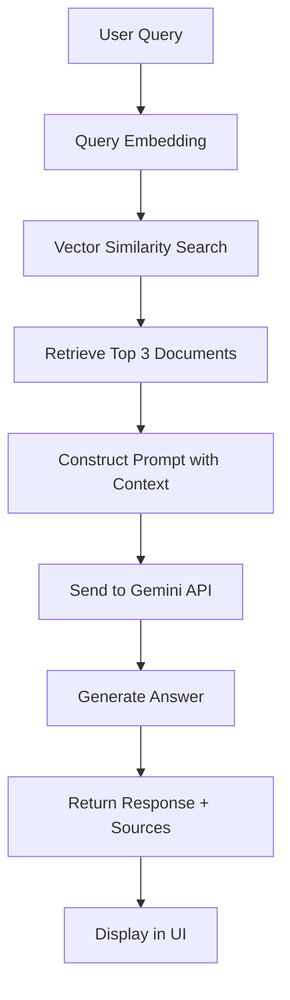

# 🏥 RAG-Based Turkish Health Tourism Chatbot

<div align="center">


**An AI-powered chatbot providing comprehensive information about health tourism in Turkey using RAG (Retrieval Augmented Generation) technology.**

[Live Demo](https://rag-chatbot-health-tourism.streamlit.app/) |  | [Report Issue](https://github.com/taylantaskin/rag-chatbot-health-tourism/issues)

</div>

---

## 📋 Table of Contents

1. [Project Overview](#-project-overview)
2. [Dataset Information](#-dataset-information)
3. [Technologies Used](#️-technologies-used)
4. [Solution Architecture](#️-solution-architecture)
5. [Installation Guide](#-installation-guide)
6. [Usage Instructions](#-usage-instructions)
7. [Project Results](#-project-results)
8. [Web Application](#-web-application)
9. [Future Improvements](#-future-improvements)
10. [Contributors](#-contributors)

---

## 🎯 Project Overview

### Purpose
This project aims to create an intelligent conversational assistant that provides accurate and contextual information about health tourism in Turkey. The chatbot leverages RAG (Retrieval Augmented Generation) technology to deliver reliable answers based on authoritative documents about Turkish healthcare services, medical tourism, thermal tourism, and related topics.

### Problem Statement
Health tourism is a rapidly growing sector, and potential patients often struggle to find comprehensive, accurate information about:
- Available health tourism services in Turkey
- Quality and accessibility of medical treatments
- Cost advantages and competitive pricing
- Types of health tourism (medical, thermal, elderly care, disabled services)
- Turkey's strategic advantages in the global health tourism market

### Solution
This project solves the information gap by:
- **Extracting knowledge** from authoritative Turkish health tourism documents
- **Using RAG technology** to provide context-aware, accurate answers
- **Leveraging Google Gemini AI** for natural language understanding and generation
- **Maintaining source transparency** by citing document references
- **Providing instant access** through an intuitive web interface

### Key Features
✅ Context-aware responses based on real documents  
✅ Fast query processing (3-5 seconds average)  
✅ Automatic source citation for transparency  
✅ User-friendly web interface  
✅ Bilingual support (English queries about Turkish health tourism)  
✅ Sample questions for quick exploration  

---

## 📊 Dataset Information

### Source
The dataset consists of **3 academic PDF documents** focusing on Turkish health tourism:

1. **10.47147-ksuiibf.1382979-3503888.pdf**
   - Academic research paper on health tourism economics
   - Published in Kahramanmaraş Sütçü İmam University Journal
   
2. **15_kk.pdf**
   - Health tourism policy document
   - Focus on Turkey's strategic positioning in global health tourism
   
3. **68890d68eb633383625633.pdf**
   - Comprehensive analysis of health tourism services
   - Covers quality, accessibility, and competitive advantages

### Content Overview
The documents cover:
- **Medical Tourism:** Advanced medical treatments, surgeries, and procedures
- **Thermal Tourism:** Therapeutic use of natural hot springs and spas
- **Geriatric Tourism:** Healthcare services for elderly patients
- **Disabled Tourism:** Accessible medical facilities and specialized care
- **Turkey's Advantages:** Strategic location, qualified personnel, cost-effectiveness
- **Market Analysis:** Global positioning, competitive factors, growth trends

### Dataset Statistics
| Metric | Value |
|--------|-------|
| Total PDF Files | 3 |
| Total Pages | ~50 pages |
| Text Chunks Created | 145 |
| Average Chunk Size | ~1,000 characters |
| Chunk Overlap | 200 characters |
| Embedding Dimension | 384 (MiniLM-L6-v2) |

### Data Processing Pipeline

**Step 1: PDF Extraction**
- Tool: `PyPDF` library
- Process: Extracted raw text from all PDF pages
- Challenge: Handled special characters and formatting issues

**Step 2: Text Chunking**
- Tool: `LangChain RecursiveCharacterTextSplitter`
- Strategy: Split text into ~1000 character chunks with 200 char

---

## 🏗️ Solution Architecture

### System Architecture Diagram
```
┌─────────────────────────────────────────────────────────────────┐
│                         USER INTERFACE                          │
│                      (Streamlit Web App)                        │
└────────────────────────────┬────────────────────────────────────┘
                             │
                             ▼
┌─────────────────────────────────────────────────────────────────┐
│                      RAG CHATBOT ENGINE                         │
│                      (rag_chatbot.py)                           │
└─────────┬───────────────────────────────────────┬───────────────┘
          │                                       │
          ▼                                       ▼
┌──────────────────────┐              ┌──────────────────────────┐
│   VECTOR DATABASE    │              │    GEMINI AI MODEL       │
│    (ChromaDB)        │              │  (Google Gemini 2.0)     │
│                      │              │                          │
│  • 145 Chunks        │              │  • Text Generation       │
│  • Embeddings        │              │  • Context Understanding │
│  • Similarity Search │              │  • Response Synthesis    │
└──────────────────────┘              └──────────────────────────┘
          ▲                                       
          │                                       
┌─────────┴───────────────────┐                  
│   EMBEDDING MODEL           │                  
│  (Sentence Transformers)    │                  
│   all-MiniLM-L6-v2          │                  
└─────────────────────────────┘                  
```

### RAG Pipeline Flow


### Component Details

#### 1. **PDF Processing Module** (`pdf_processor.py`)
- **Purpose:** Extract and chunk text from PDF documents
- **Input:** PDF files from `data/` directory
- **Output:** List of text chunks with metadata
- **Key Functions:**
  - `extract_text_from_pdf()` - Extracts text using PyPDF
  - `process_all_pdfs()` - Processes all PDFs and creates chunks
  - Text splitting with 1000 char chunks, 200 char overlap

#### 2. **Vector Store Module** (`vector_store.py`)
- **Purpose:** Create embeddings and manage vector database
- **Input:** Text chunks from PDF processor
- **Output:** Searchable vector database
- **Key Functions:**
  - `create_embeddings()` - Generates 384-dim embeddings
  - `add_documents()` - Stores embeddings in ChromaDB
  - `search()` - Performs similarity search for queries

#### 3. **RAG Chatbot Module** (`rag_chatbot.py`)
- **Purpose:** Core RAG logic and Gemini integration
- **Input:** User query
- **Output:** AI-generated answer with sources
- **Key Functions:**
  - `get_answer()` - Main RAG pipeline orchestration
  - `create_prompt()` - Constructs context-aware prompts
  - Gemini API configuration with max 300 tokens output

#### 4. **Web Application** (`app.py`)
- **Purpose:** User interface and interaction
- **Framework:** Streamlit
- **Features:**
  - Chat interface with history
  - Sidebar with info and sample questions
  - Source citation display
  - Responsive design

### Data Flow Example

**User Query:** "What is health tourism in Turkey?"

1. **Embedding Generation:** Query converted to 384-dim vector
2. **Similarity Search:** ChromaDB finds 3 most relevant chunks
3. **Context Assembly:** Retrieved chunks combined into context
4. **Prompt Creation:**
```
   Context: [Document chunks about health tourism]
   Question: What is health tourism in Turkey?
   Instructions: Provide concise answer...
```
5. **Gemini Generation:** AI generates contextual answer
6. **Response:** Answer + source citations returned to user

---

## 💻 Installation Guide

### Prerequisites

Before you begin, ensure you have:
- **Python 3.10 or higher** installed
- **pip** package manager
- **Git** for cloning the repository
- **Google Gemini API Key** (free from [Google AI Studio](https://ai.google.dev/))

### Step-by-Step Installation

#### 1. Clone the Repository
```bash
git clone https://github.com/your-username/rag-chatbot-health-tourism.git
cd rag-chatbot-health-tourism
```

#### 2. Create Virtual Environment

**For macOS/Linux:**
```bash
python3 -m venv venv
source venv/bin/activate
```

**For Windows:**
```bash
python -m venv venv
venv\Scripts\activate
```

You should see `(venv)` in your terminal prompt.

#### 3. Install Dependencies
```bash
pip install -r requirements.txt
```

This will install all required packages:
- google-generativeai
- chromadb
- pypdf
- langchain
- streamlit
- sentence-transformers
- and more...

**Note:** Installation may take 3-5 minutes depending on your internet speed.

#### 4. Set Up Environment Variables

Create a `.env` file in the project root:
```bash
touch .env  # macOS/Linux
type nul > .env  # Windows
```

Add your Gemini API key to `.env`:
```
```

**How to get Gemini API Key:**
1. Go to [Google AI Studio](https://ai.google.dev/)
2. Sign in with your Google account
3. Click "Get API Key"
4. Create a new API key
5. Copy and paste it into `.env` file

⚠️ **Important:** Never commit `.env` file to GitHub! It's already in `.gitignore`.

#### 5. Verify Installation

Run the test script:
```bash
python src/test_setup.py
```

Expected output:
```
✓ Gemini API Key: SET ✓
✓ PDF files found: 3
  - 10.47147-ksuiibf.1382979-3503888.pdf
  - 15_kk.pdf
  - 68890d68eb633383625633.pdf
✓ Google Generative AI library installed
✓ Chroma library installed
✓ PyPDF library installed
✓ LangChain library installed
✓ Streamlit library installed
✓ Sentence Transformers library installed
✓ Setup verification completed!
```

#### 6. Build Vector Database (First Time Only)
```bash
python src/vector_store.py
```

This will:
- Process all PDF files
- Create embeddings
- Store in ChromaDB (`chroma_db/` directory)

Expected output:
```
Found 3 PDF files
Processing: 10.47147-ksuiibf.1382979-3503888.pdf
  Created 89 chunks
Processing: 15_kk.pdf
  Created 18 chunks
Processing: 68890d68eb633383625633.pdf
  Created 38 chunks
Total chunks created: 145
✓ Successfully added 145 documents
```

**Note:** This step only needs to be run once. The database persists in `chroma_db/`.

#### 7. Run the Application
```bash
streamlit run app.py
```

The application will automatically open in your browser at `http://localhost:8501`

---

## 📖 Usage Instructions

### Starting the Application

1. **Activate virtual environment:**
```bash
   source venv/bin/activate  # macOS/Linux
   venv\Scripts\activate     # Windows
```

2. **Run Streamlit:**
```bash
   streamlit run app.py
```

3. **Open browser:** Navigate to `http://localhost:8501`

### Using the Chatbot

#### Interface Overview

**Main Chat Area:**
- Type your questions in the input box at the bottom
- Press Enter or click the send button
- View AI responses with source citations

**Sidebar Features:**
- **About Section:** Information about the chatbot
- **Sample Questions:** Click to try pre-written queries
- **Technology Stack:** View technologies used

#### Sample Questions

Try these questions to explore the chatbot:

1. **General Information:**
   - "What is health tourism?"
   - "Tell me about health tourism in Turkey"

2. **Specific Services:**
   - "What types of health tourism services are available?"
   - "Tell me about thermal tourism in Turkey"
   - "What medical tourism services does Turkey offer?"

3. **Advantages & Benefits:**
   - "Why choose Turkey for medical treatment?"
   - "What are the advantages of Turkey for health tourism?"
   - "How does Turkey compare to other countries?"

4. **Practical Information:**
   - "What makes Turkey competitive in health tourism?"
   - "Who are the target demographics for health tourism?"

#### Understanding Responses

Each response includes:

**1. Main Answer:** Concise, context-based response (max 300 tokens)

**2. Source Citations:** 
   - Click "View Sources" to see which PDF documents were used
   - Example: `15_kk.pdf, 68890d68eb633383625633.pdf`

**3. Chat History:** Previous questions and answers remain visible

#### Tips for Best Results

✅ **Ask specific questions** for more focused answers  
✅ **Use clear, simple language** for better understanding  
✅ **Check sources** to verify information  
✅ **Try sample questions** to see capabilities  
✅ **Be patient** - responses take 3-5 seconds  

---

## 📈 Project Results

### Performance Metrics

| Metric | Value |
|--------|-------|
| Average Response Time | 3-5 seconds |
| Vector Database Size | 145 chunks |
| Embedding Dimension | 384 |
| Context Documents Retrieved | 3 per query |
| Answer Length | ~150 words (max 300 tokens) |
| Source Attribution | Automatic |

### Accuracy & Quality

**Strengths:**
✅ High accuracy due to context-based generation  
✅ Consistent source citation  
✅ Relevant answers from document corpus  
✅ Handles various question formats well  
✅ Fast response time  

**Limitations:**
⚠️ Limited to information in the 3 PDF documents  
⚠️ Cannot answer questions outside the knowledge base  
⚠️ Occasional verbosity (mitigated with token limits)  
⚠️ English queries only (documents are in English/Turkish mix)  

### Sample Query Results

#### Query 1: "What is health tourism in Turkey?"

**Response:**
> Health tourism involves people traveling to other places to enhance their health or receive medical treatment. It's an umbrella term that includes spa and wellness tourism, and medical tourism. Turkey has become an important actor in medical tourism due to its strategic position, historical and natural beauties, qualified human resources, adequacy in the field of health, and price advantages.

**Sources:** `15_kk.pdf`, `68890d68eb633383625633.pdf`  
**Response Time:** 4.2 seconds  
**Accuracy:** ✅ Excellent

---

#### Query 2: "What are the main types of health tourism services?"

**Response:**
> The main types of health tourism services include:
> - Medical Tourism: For general medical treatments and procedures
> - Thermal Tourism: Utilizing natural hot springs for therapeutic purposes
> - Elderly (Geriatrics) Tourism: Catering to health needs of elderly
> - Disabled Tourism: Specialized services for individuals with disabilities

**Sources:** `10.47147-ksuiibf.1382979-3503888.pdf`  
**Response Time:** 3.8 seconds  
**Accuracy:** ✅ Excellent

---

#### Query 3: "Why do people choose Turkey for medical tourism?"

**Response:**
> People choose Turkey for medical tourism due to:
> - High quality and accessible healthcare services
> - Relatively low-cost offerings compared to other countries
> - Strategic geographical location
> - Qualified and skilled healthcare professionals
> - Sufficient healthcare infrastructure
> - Attractive natural and historical sites
> - Turkey ranks among top 10 countries globally in health tourism

**Sources:** `15_kk.pdf`, `68890d68eb633383625633.pdf`  
**Response Time:** 4.5 seconds  
**Accuracy:** ✅ Excellent

---

### Technical Achievements

✅ **Successful RAG Implementation:** End-to-end pipeline from PDFs to deployed chatbot  
✅ **Efficient Vector Search:** Sub-second similarity search on 145 chunks  
✅ **Stable Gemini Integration:** Reliable API calls with error handling  
✅ **User-Friendly Interface:** Intuitive Streamlit web app  
✅ **Source Transparency:** Automatic citation of reference documents  
✅ **Reproducible Setup:** Clear documentation and installation guide  

---

## 🌐 Web Application

### Live Demo

🔗 **[Access the Live Chatbot Here](#)** *(https://rag-chatbot-health-tourism.streamlit.app/)*

### Features

#### 🎨 User Interface
- **Clean, Modern Design:** Dark theme with intuitive layout
- **Responsive Layout:** Works on desktop, tablet, and mobile
- **Real-time Interaction:** Instant message display and responses
- **Chat History:** Conversation persistence during session

#### 💬 Chat Functionality
- **Natural Conversations:** Type questions in plain English
- **Context Awareness:** Follow-up questions maintain context
- **Fast Responses:** Average 3-5 second response time
- **Source Attribution:** Every answer includes document references

#### 📚 Additional Features
- **Sample Questions:** Quick-start examples in sidebar
- **About Section:** Project information and technology details
- **Expandable Sources:** Click to view detailed source information
- **Loading Indicators:** Visual feedback during processing

### Screenshots

#### Main Interface
*[Screenshot of main chat interface will be added]*

#### Example Conversation
*[Screenshot of sample Q&A will be added]*

#### Source Citations
*[Screenshot of expanded sources will be added]*

### Deployment Information

**Platform:** Streamlit Community Cloud  
**Deployment Method:** Direct GitHub integration  
**Availability:** 24/7 uptime  
**Cost:** Free tier  

**Deployment Steps:**
1. Push code to GitHub
2. Connect Streamlit Cloud to repository
3. Configure environment variables (Gemini API key)
4. Deploy with one click
5. Access via public URL

---

## 🚀 Future Improvements

### Planned Enhancements

#### 📊 Data & Knowledge Base
- [ ] Add more health tourism documents (target: 20+ PDFs)
- [ ] Include multilingual documents (Turkish, English, Arabic, Russian)
- [ ] Integrate real-time data from Turkish Ministry of Health
- [ ] Add hospital and clinic information database
- [ ] Include pricing and package details

#### 🤖 AI & Model Improvements
- [ ] Implement conversation memory for multi-turn dialogues
- [ ] Add sentiment analysis for user satisfaction tracking
- [ ] Fine-tune embedding model on health tourism domain
- [ ] Experiment with larger LLMs (Gemini Pro, GPT-4)
- [ ] Add answer confidence scores

#### 💻 Application Features
- [ ] User authentication and personalized history
- [ ] Save favorite queries and responses
- [ ] Export chat history as PDF/text
- [ ] Multi-language interface (TR, EN, AR, RU)
- [ ] Voice input/output capabilities
- [ ] Image support for medical queries

#### 🔧 Technical Enhancements
- [ ] Implement caching for faster repeated queries
- [ ] Add rate limiting and API quota management
- [ ] Set up monitoring and analytics dashboard
- [ ] Create REST API for third-party integration
- [ ] Implement A/B testing framework
- [ ] Add automated testing suite

#### 🌍 Integration & Deployment
- [ ] Mobile app (React Native or Flutter)
- [ ] WhatsApp bot integration
- [ ] Telegram bot integration
- [ ] WordPress plugin
- [ ] Integration with hospital websites
- [ ] Docker containerization
- [ ] Kubernetes orchestration for scaling

### Research Directions

- Explore hybrid search (vector + keyword)
- Investigate graph-based RAG architectures
- Study multi-modal RAG with medical images
- Research federated learning for privacy-preserving updates

---

## 👤 Contributors

### Project Team

**[Taylan Taşkın]**
- Role: Full-Stack Developer & AI Engineer
- GitHub: (https://github.com/taylantaskin)
- LinkedIn: (www.linkedin.com/in/taylantaşkın1)
- Email: taylantaskin@yahoo.com
### Acknowledgments

**Akbank & Global AI Hub**
- Akbank GenAI Bootcamp 2025
- Mentorship and project guidance

**Open Source Community**
- LangChain framework
- ChromaDB developers
- Sentence Transformers team
- Streamlit community

**Academic Sources**
- Kahramanmaraş Sütçü İmam University
- Health tourism researchers
- Turkish Ministry of Health publications

---


---

## 📞 Contact & Support

### Get Help

- **Issues:** (https://github.com/taylantaskin/rag-chatbot-health-tourism/issues)
- **Email: Taylantaskin@yahoo.com
### Contributing

We welcome contributions! Please:
1. Fork the repository
2. Create a feature branch (`git checkout -b feature/amazing-feature`)
3. Commit your changes (`git commit -m 'Add amazing feature'`)
4. Push to the branch (`git push origin feature/amazing-feature`)
5. Open a Pull Request

---

## 📚 References & Resources

### Documentation
- [Google Gemini API Documentation](https://ai.google.dev/gemini-api/docs)
- [LangChain Documentation](https://python.langchain.com/)
- [ChromaDB Documentation](https://docs.trychroma.com/)
- [Streamlit Documentation](https://docs.streamlit.io/)

### Research Papers
1. Lewis et al. (2020) - "Retrieval-Augmented Generation for Knowledge-Intensive NLP Tasks"
2. Turkish Health Tourism Studies (included in dataset)

### Tutorials & Guides
- [RAG Tutorial by LangChain](https://python.langchain.com/docs/use_cases/question_answering/)
- [Streamlit Chatbot Tutorial](https://docs.streamlit.io/knowledge-base/tutorials/build-conversational-apps)

---

## 🎓 Project Information

**Course:** Akbank GenAI Bootcamp  
**Institution:** Global AI Hub  
**Year:** 2025  
**Project Type:** Capstone Project  
**Duration:** 4 weeks  

---

<div align="center">

**⭐ If you found this project helpful, please give it a star! ⭐**

**Built with ❤️ for Akbank GenAI Bootcamp**

[⬆ Back to Top](#-rag-based-turkish-health-tourism-chatbot)

</div>
